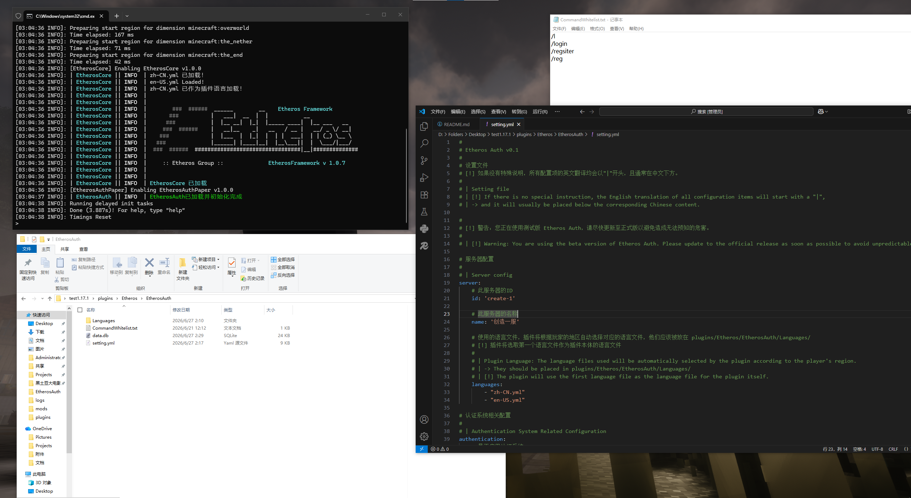
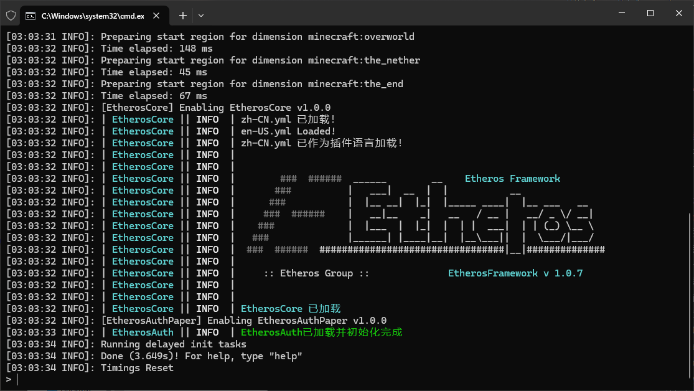
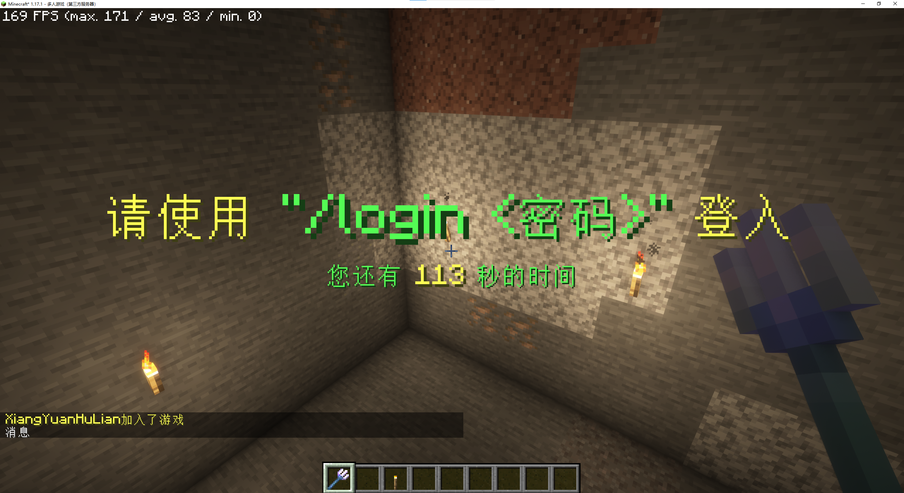
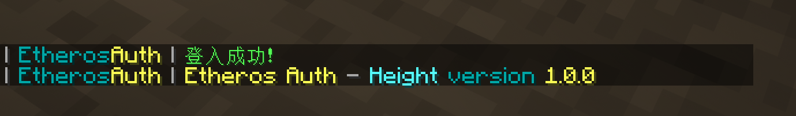

# EtherosAuth - Height

---
## 需求速览：
* 适用版本：```Minecraft 1.17 – 1.20.4```
* 前置插件：```EtherosCore-Height``` [Github](https://github.com/EtherosGroup/EtherosCore-Height)

## 认证功能：
### 本地（Local）
* 登入 注册（默认关闭） 修改密码
* 限制玩家名称（在```setting.yml```配置）
* 登录时传送到```setting.yml```指定的世界出生点，登录之后自动返回下线地点
* 同一玩家不允许重复登入，重复登入请求将被拒绝
* 登入之前禁止移动、与容器或实体交互、攻击或被攻击、聊天（不排除使用聊天插件的情况）、使用指令（可在```CommandWhitelist.txt```配置）、拾取或丢弃物品
* 数据库支持
    * SQLite（默认）
    * MariaDB
    * PosterSQL
    * MySQL
* 数据存储：BCrypt加密存储
### 官方（Official）
* *这里的官方指的是遵循EtherosAuthAPI的服务提供商，而非独Etheros官方，可以在Setting.yml中切换服务提供商*
* 统一通行证（由服务提供商发放）
* 云端注册（玩家在服务商处注册通行证，然后游戏内玩家绑定通行证）
* 游戏加入服务器后需要在官方网页/APP确认请求后才放行
* 保存设备，指定天数内免认证登入（需要客户端安装MOD）
* 所有玩家数据云端保存
* 云端下线、撤销授权、封禁服务器（指的是不进入某个服务器）
* 服主云端封禁玩家账户
* 账户全局封禁（该账户被服务提供商封禁、无法进入任何使用该服务提供商的服务器）
### 自定义（Custom）
* *自定义指的是用户认证逻辑将由开发者自己编写的js/jar文件实现，使用于需要高度自定义的服务器*

## 群组：
正在开发ing

## 预览：
> 概览
> 

> 控制台
> 

> 登入
> 

> 信息
> 

> 重复登入
> 

## 配置文件：

## TODO LIST：
**下一阶段实现：```群组```**
* 群组支持（BungeeCord、Velocity）
* 自定义认证方式
* 官方认证方式+EtherosAuthAPI